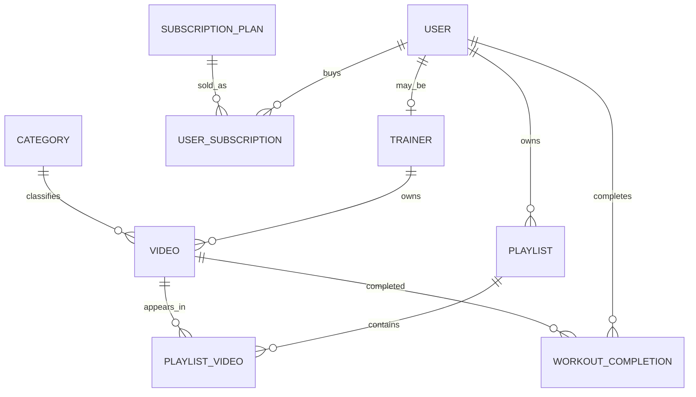

# FitNest Database Design

## 1. Infosüsteemi üldvaade

FitNest on veebipõhine treeninguplatvorm, kus kasutaja saab:

- registreerida ja sisse logida;
- osta erineva tasemega pakette;
- vaadata treeningvideoid;
- teha playlist'e;
- jälgida oma treeningute lõpetamist.

Rollid:

- `USER`: tavakasutaja.
- `ADMIN`: administraator.

Treenerid on süsteemis eraldi olem, mis seotakse vajadusel kasutajakontoga.

## 2. ER-diagramm



## 3. Tabelid

Projekti relatsiooniline andmebaas sisaldab 9 põhitablet:

1. `users`
2. `trainers`
3. `categories`
4. `videos`
5. `subscription_plans`
6. `user_subscriptions`
7. `playlists`
8. `playlist_videos`
9. `workout_completions`

See on mõõdukas laiendus võrreldes lihtsama 8-tabelilise lahendusega, kuid jääb kaitsmiseks hästi hallatavaks.

## 4. Normaalkujud ja denormaliseerimine

- Enamik tabeleid on vähemalt 3NF-is.
- M:N seos on lahendatud tabeliga `playlist_videos`.
- `users.rolecode` on teadlik lihtsustus, et õiguste kontroll oleks rakenduses ja JWT loogikas lihtne.

## 5. Füüsiline disain

- Prisma mudelid: [server/prisma/schema.prisma](/Users/leonti/Library/CloudStorage/OneDrive-TallinnaTehnikaülikool/Veebiprogrammeerimine%202026/Treeningute_platvorm/server/prisma/schema.prisma)
- PostgreSQL DDL: [docs/database-ddl.sql](/Users/leonti/Library/CloudStorage/OneDrive-TallinnaTehnikaülikool/Veebiprogrammeerimine%202026/Treeningute_platvorm/docs/database-ddl.sql)
- Täiendavad SQL-objektid: [docs/database-support.sql](/Users/leonti/Library/CloudStorage/OneDrive-TallinnaTehnikaülikool/Veebiprogrammeerimine%202026/Treeningute_platvorm/docs/database-support.sql)

## 6. Indeksid

- `users(rolecode)`
- `users(accountstatus)`
- `videos(categoryid, trainerid)`
- `videos(accesstier, publishedat DESC)`
- `user_subscriptions(userid, status)`
- `workout_completions(userid, completedat DESC)`

Need toetavad admin-vaateid, videotefiltreid, ligipääsu kontrolli ja progressivaateid.

## 7. Vaated rollide kaupa

### USER

- `member_access_overview`
- `member_progress_snapshot`

### TRAINER

- `trainer_program_overview`
  Märkus: nimi jäi alles varasemast versioonist, kuid vaade näitab nüüd treeneri videote arvu ja lõpetamiste kogust.
- `trainer_video_catalog`

### ADMIN

- `admin_revenue_summary`
- `admin_content_quality`

## 8. Funktsioonid ja triggerid

Rakendatud PostgreSQL funktsioonid:

- `sp_create_subscription(...)`
- `sp_mark_workout_completed(...)`

Triggerid:

- `trg_subscription_startdate`
- `trg_subscription_enddate`

## 9. Testandmed

Seed-fail [server/prisma/seed.ts](/Users/leonti/Library/CloudStorage/OneDrive-TallinnaTehnikaülikool/Veebiprogrammeerimine%202026/Treeningute_platvorm/server/prisma/seed.ts) loob:

- admin-kasutaja;
- demo tavakasutaja;
- 4 treenerit;
- 5 kategooriat;
- 10 videot;
- 3 paketti;
- demo tellimuse;
- demo pleilisti;
- demo lõpetatud treeningud.

## 10. NoSQL näide

Sobiv NoSQL variant oleks MongoDB dokument kasutaja dashboard'i jaoks:

```json
{
  "userId": 6,
  "name": "Demo Member",
  "accessTier": "STARTER",
  "activePlan": "Starter 1 Month",
  "playlists": [
    { "playlistId": 1, "playlistName": "Starter Playlist" }
  ],
  "progress": {
    "workoutsCompleted": 2,
    "lastCompletedAt": "2026-05-20T10:00:00Z"
  }
}
```

Eelis:

- kiire lugemine kasutaja avalehe jaoks.

Puudus:

- dubleeritud andmed ja keerulisem järjepidevus võrreldes PostgreSQL-iga.
